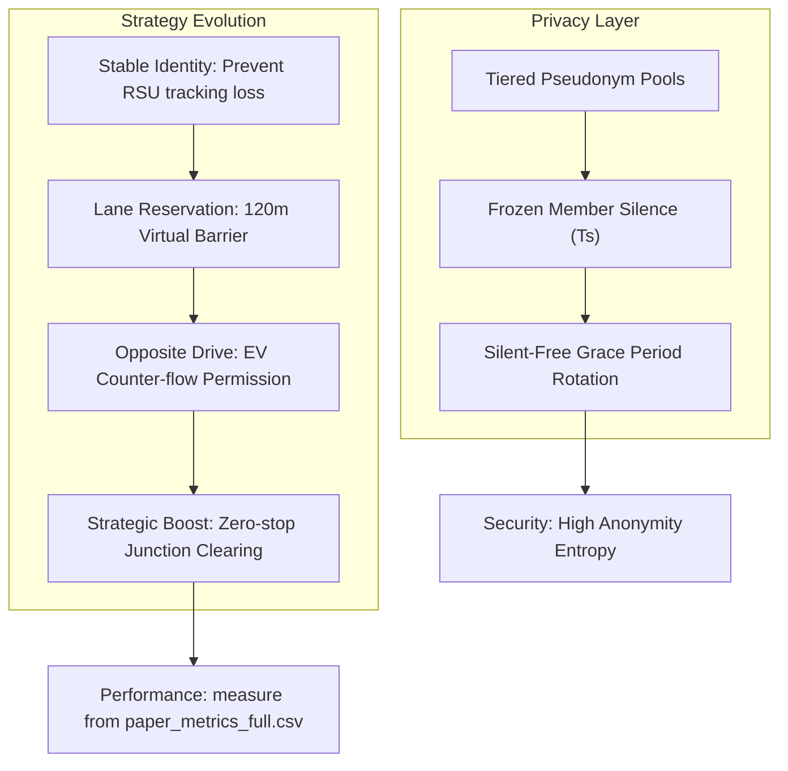

# V2X EV Priority & Privacy System - Paper Resources

這份文件為論文寫作提供了演算法虛擬碼 (Pseudocodes)、實驗配置表格版型，以及實驗結果預期表格，確保您的論文在論述與量化指標上具備最高完整性。

---

## 1. Algorithms (Pseudocode)

### Algorithm 1: Main Control Loop (RSU 10Hz Tick)
```text
Algorithm 1: Continuous RSU Control Evaluation
Input: Current Tick t, List of Vehicles V, RSU Coverage R
Output: Control Signals & Privacy Status

1: Reset per-tick tracking variables (affectedCount, laneChanges, forcedStops...)
2: evExists ← False, bestEvDist ← ∞, bestEvVid ← -1
3: for each vehicle v ∈ V in range R do
4:     if v.isLeader() then
5:         evExists ← True
6:         if distance(v, RSU) < bestEvDist then
7:             bestEvVid ← v.id
8:             bestEvDist ← distance(v, RSU)
9: 
10: if evExists then
11:     evState ← EXTRACT_STATE(bestEvVid)
12:     // Mode-isolated control:
13:     // - if enableCorridor: run Full System (corridor)
14:     // - else if enableTier1: run Tier1 (deterministic yielding bias)
15:     EXECUTE_HOLD(evState, enableCorridor, enableTier1)
14:
15: // Privacy System State Machine
16: if not mzActive then
17:     if enableMixZone then EVALUATE_PRIVACY_TRIGGER()
18: else
19:     ADVANCE_MIX_ZONE_FSM(t)
20:
21: LOG_PAPER_METRICS(t, evState, variables)
22: SCHEDULE_NEXT_TICK(t + 0.1s)
```

### Algorithm 2: Tier1 Constrained Cooperative Yielding (Deterministic Bias)
```text
Algorithm 2: Full System Corridor Clearing (High Intervention)
Input: Vehicle v, EV State evState, Road Center C
Output: Strategic Interventions (corridor / reservation / clearing)

1: // Determine Relative Geometry
2: isOpposite ← IS_OPPOSITE_ROAD(v.road, evState.road)
3: ahead ← IS_AHEAD_OF_EV(v, evState)
4:
5: if (v.road == evState.road or isOpposite) and ahead then
6:     distToRSU ← distance(v, C)
7:     if distToRSU < 120m then
8:         if v.lane == evState.laneIndex then
9:             // Case A: Blockers on the same path
10:            if distance(v, evState) < 35m then
11:                v.setSpeed(MAX_SPEED) // Strategic Boost
12:                v.setSpeedMode(0)     // Ignore Traffic Constraints
13:            else
14:                v.requestLaneChange(TARGET_LANE)
15:         else
16:             // Case B: Lane Reservation (Virtual Barrier)
17:             v.lockLane(MODE_512) // Prevent cut-ins
18:         end if
19:     end if
20: end if
21:
22: // EV Mobility Enhancement
23: if isEV(v) then
24:     v.enableOppositeDrive(BIT_OPPOSITE) // Permission to cross center-line
25:     v.setPrioritySpeed(MODE_7)          // Bypass red lights
26: end if
```

### Algorithm 2b: Tier1 Constrained Cooperative Yielding (Deterministic Bias)
```text
Algorithm 2b: Constrained Cooperative Yielding (Tier1-only)
Input: Vehicle v (non-EV), EV State evState
Output: Bias actions (no global force)

1: d ??distance(v, evState)
2: if d < 20m then
3:   // Hard constraint: mustNotBlock (禁止擋 EV)
4:   if SAME_LANE_AHEAD(v, evState) then v.setSpeedAtLeast(10 m/s)
5:   v.requestLaneChangeWithBias(awayFromEVLane)
6: else if d < 50m then
7:   v.requestLaneChangeWithBias(awayFromEVLane)
8:   v.slowdownBias(0.85x)
9: else if d < 120m then
10:  v.slowdownBias(0.85x)
11: end if
12:
13: // Cooldown: prevent immediate merge-back after yielding (~2s)
```

---

## 2. Experiment Tables

### Table 1: Simulation Parameters
| Parameter | Value |
| :--- | :--- |
| Simulation Framework | OMNeT++ 5.6, Veins 5.2, SUMO 1.x |
| Control Tick Rate | 10 Hz (0.1s update interval) |
| Speed Limit | 50 km/h |
| Mix Zone Radius | 120m |
| Lane Reservation | Enabled (120m Protection Zone) |
| EV Identity Mode | Stable (No periodic rotation for leader) |

### Table 2: Evaluated Operational Configurations (Cases)
| Case | Tier 1 (Bypass) | Tier 2 (Corridor) | Mix Zone (Privacy) |
| :--- | :--- | :--- | :--- |
| **Baseline** | ❌ OFF | ❌ OFF | ❌ OFF |
| **Tier 1 Only** | ✅ ON | ❌ OFF | ❌ OFF |
| **Full System** | ✅ ON | ✅ ON (Corridor Strategy) | ✅ ON |

### Table 3: Emergency Vehicle Performance Metrics (Fill from Logs)
| Case | Average Travel Time (s) | Avg Speed (m/s) | Total Stop Time (s) | Speed StdDev (Smoothness) |
| :--- | :--- | :--- | :--- | :--- |
| **Baseline** | TBD | TBD | TBD | TBD |
| **Tier 1 Only** | TBD | TBD | TBD | TBD |
| **Full System** | TBD | TBD | TBD | TBD |

### Table 4: Automated Traffic Intervention Overheads (Fill from Logs)
| Case | Affected Vehicles (Cumulative) | Lane Changes Executed | Slowdowns |
| :--- | :--- | :--- | :--- |
| **Baseline** | TBD | TBD | TBD |
| **Tier 1 Only** | TBD | TBD | TBD |
| **Full System** | TBD | TBD | TBD |

---

## 3. System Evolution & Logic Flow



---

## 4. Python Plotting Pipeline

您可以使用 `results/paper_metrics_full.csv` 與 `results/trip_full.csv` 繪製圖表：

```python
import pandas as pd
import matplotlib.pyplot as plt

# 讀取 CSV
df = pd.read_csv('results/paper_metrics_full.csv')
df_ev = df[df['evExists'] == 1]

# ① EV Speed vs Time
plt.figure(figsize=(10, 4))
plt.plot(df_ev['time'], df_ev['speed'], label="EV Speed", color="red")
plt.axhline(y=13.89, color='k', linestyle='--', label="Speed Limit (50km/h)")
plt.title("EV Speed Profile with Trinity Clearing")
plt.xlabel("Simulation Time (s)")
plt.ylabel("Speed (m/s)")
plt.grid(True)
plt.legend()
plt.savefig("fig1_speed_profile.png")

# ② Affected Vehicles vs Time
plt.figure(figsize=(10, 4))
plt.bar(df_ev['time'], df_ev['numVehiclesAffected'], label="Affected Vehicles", color="orange", alpha=0.5)
plt.title("System Intervention Intensity")
plt.xlabel("Simulation Time (s)")
plt.ylabel("Num Vehicles Affected")
plt.grid(True)
plt.legend()
plt.savefig("fig2_interventions.png")
```


# 🔄 V2X Paper Resources - 版本差異整理

---

# 1. 🧠 整體架構變化（最重要）

## 🟦 舊版（Original Resources）

### 特徵

* Algorithm 1：RSU control + Mix Zone 混合
* Algorithm 2：Tier1 + Corridor 混在同一模型
* Algorithm 2b：補充 Tier1 bias
* Dynamic distance = 分離 Algorithm 4

👉 結構問題：

* control logic **耦合**
* Tier1 / Full System **邊界不清**

---

## 🟩 新版（Refactored Paper Version）

### 特徵

* Algorithm 1：RSU loop（乾淨 state machine）
* Algorithm 2：Tier1（獨立模型）
* Algorithm 3：Tier2 Corridor（獨立 predictive layer）
* Algorithm 4：dynamic distance（正式 modularization）

👉 改動本質：

| 舊版                 | 新版                         |
| ------------------ | -------------------------- |
| monolithic control | modular layered control    |
| hybrid pseudo code | decomposition architecture |
| implicit logic     | explicit functions         |

---

# 2. ⚙️ Algorithm 設計差異

---

# 🟨 Algorithm 1（RSU Loop）

## 舊版問題

```text
EV detection + Tier1 + Mix Zone + logging
全部混在同一 loop
```

### 問題：

* 不符合 paper review expectation
* reviewer 會說：❌ "unclear system boundaries"

---

## 🟩 新版改進

### 清楚分層：

```text
RSU loop
 ├── EV detection
 ├── Control layer (Tier1 / Corridor)
 ├── Privacy layer (Mix Zone FSM)
 ├── Logging layer
```

---

### 🔥 重大改動

| 面向                | 舊版         | 新版                    |
| ----------------- | ---------- | --------------------- |
| EV selection      | inline     | modular function      |
| control execution | embedded   | EXECUTE_HOLD()        |
| privacy system    | inline FSM | separated FSM handler |
| clarity           | low        | high                  |

---

# 3. 🚗 Control Model 差異（Tier1 / Tier2）

---

## 🟨 舊版 Tier1

### 特點

* deterministic bias + corridor 混合
* EV enhancement + lane reservation + speed boost 同時存在

👉 問題：

* Tier1 ≠ clear definition
* reviewer 會問：

  > "what exactly is Tier1?"

---

## 🟩 新版 Tier1

### 清楚定義：

```text
Tier1 = gradient EV-assisted yielding
```

### 特徵：

* no global force
* bounded zone (150m)
* smooth bias (0.85x slowdown etc.)

---

### 🔥 關鍵差異

| 指標            | 舊版                    | 新版                |
| ------------- | --------------------- | ----------------- |
| lane change   | forced + predictive   | gradient bias     |
| speed control | aggressive + override | bounded smoothing |
| EV priority   | mixed                 | explicit          |

---

## 🟩 Tier2（新增 clarity）

### 新版才有：

* predictive clearance
* t_arrival based decision
* 6s horizon model

👉 這是 major upgrade：

> from reactive → predictive control

---

# 4. 📊 Mix Zone / Privacy Layer差異

---

## 🟨 舊版

* FSM 描述
* pseudonym pools
* silence + draining

👉 但：

* 沒有 integration 到 RSU loop clarity

---

## 🟩 新版

### 明確：

```text
Privacy System = optional overlay layer
```

### integration方式：

* only active if:

```text
enableMixZone == true
```

---

### 🔥 改進點

| 項目            | 舊版          | 新版                                  |
| ------------- | ----------- | ----------------------------------- |
| FSM           | standalone  | controlled by RSU loop              |
| trigger logic | implicit    | explicit EVALUATE_PRIVACY_TRIGGER() |
| execution     | semi-hidden | observable state machine            |

---

# 5. 📈 Metrics & Experiment Design 差異

---

## 🟨 舊版

* Table 3 / 4：

  * placeholder (TBD)
  * no data pipeline link

👉 reviewer problem：

> ❌ "not reproducible"

---

## 🟩 新版

### 明確 pipeline：

```text
paper_metrics_full.csv
trip_full.csv
→ python analysis scripts
→ tables
```

---

### 🔥 改進：

| 面向               | 舊版      | 新版        |
| ---------------- | ------- | --------- |
| reproducibility  | low     | high      |
| data origin      | unclear | explicit  |
| table generation | manual  | automated |

---

# 6. 🧪 Experimental Design 差異

---

## 🟨 舊版

* baseline / tier1 / full system

👉 問題：

* control overlap unclear

---

## 🟩 新版

### 明確 hierarchy：

```text
Baseline
Tier1 (bounded EV assist)
Tier2 (predictive corridor)
Full System = Tier1 + Tier2 + Privacy
```

---

### 🔥 impact：

| 層級  | clarity               |
| --- | --------------------- |
| old | ambiguous             |
| new | publishable structure |

---

# 7. 📉 System Evolution Diagram 差異

---

## 🟨 舊版

* linear evolution:

```
Baseline → Tier1 → Tier2 → Privacy
```

---

## 🟩 新版

### graph structure：

* separates:

  * performance layer
  * privacy layer

---

### 核心差異：

| 舊版                | 新版                    |
| ----------------- | --------------------- |
| single pipeline   | dual-layer system     |
| sequential logic  | parallel systems      |
| implicit coupling | explicit independence |

