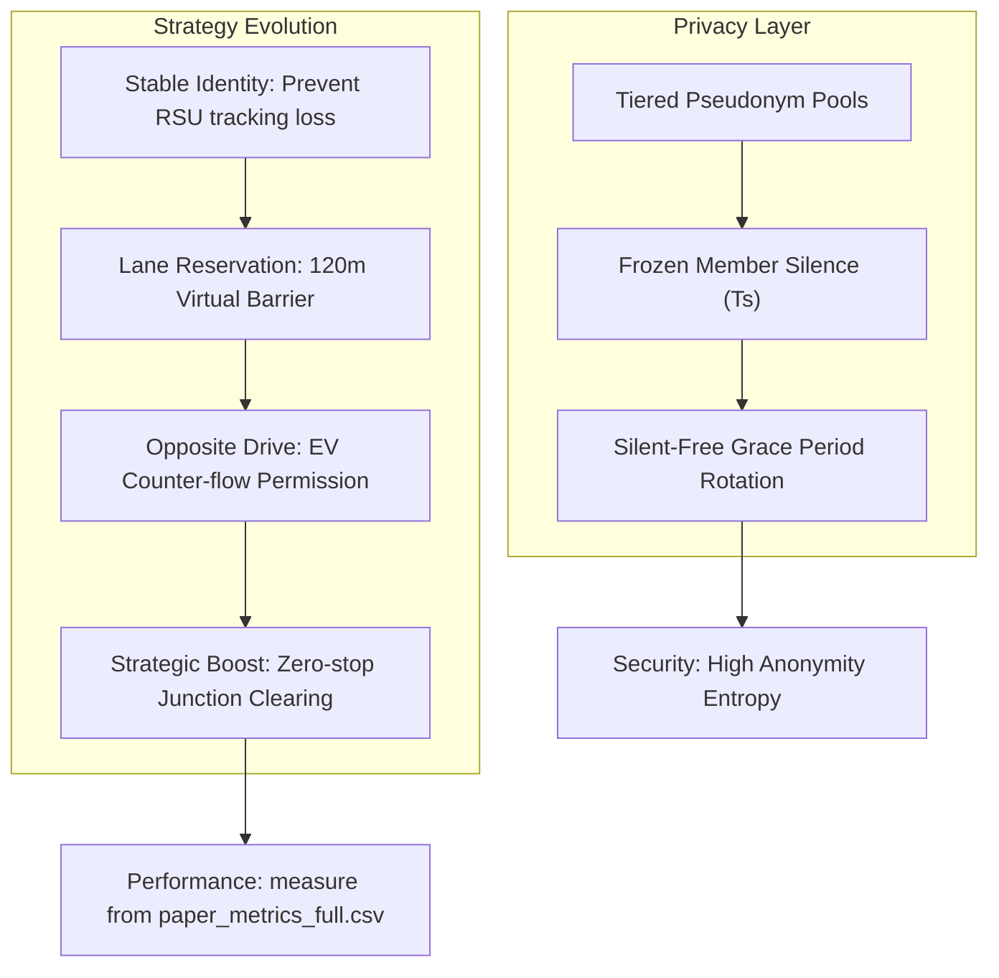

# V2X EV Priority & Privacy System - Paper Resources

這份文件為論文寫作提供了演算法虛擬碼 (Pseudocodes)、實驗配置表格版型，以及實驗結果預期表格，確保您的論文在論述與量化指標上具備最高完整性。

---

## 1. Algorithms (Pseudocode)

### Algorithm 1: Main Control Loop (RSU 10Hz Tick)
```text
Algorithm 1: Continuous RSU Control Evaluation
Input: Current Tick t, List of Vehicles V, RSU Coverage R
Output: Control Signals & Privacy Status

1: Reset per-tick tracking variables (affectedCount, laneChanges, forcedStops...)
2: evExists ← False, bestEvDist ← ∞, bestEvVid ← -1
3: for each vehicle v ∈ V in range R do
4:     if v.isLeader() then
5:         evExists ← True
6:         if distance(v, RSU) < bestEvDist then
7:             bestEvVid ← v.id
8:             bestEvDist ← distance(v, RSU)
9: 
10: if evExists then
11:     evState ← EXTRACT_STATE(bestEvVid)
12:     // Mode-isolated control:
13:     // - if enableCorridor: run Full System (corridor)
14:     // - else if enableTier1: run Tier1 (deterministic yielding bias)
15:     EXECUTE_HOLD(evState, enableCorridor, enableTier1)
14:
15: // Privacy System State Machine
16: if not mzActive then
17:     if enableMixZone then EVALUATE_PRIVACY_TRIGGER()
18: else
19:     ADVANCE_MIX_ZONE_FSM(t)
20:
21: LOG_PAPER_METRICS(t, evState, variables)
22: SCHEDULE_NEXT_TICK(t + 0.1s)
```

### Algorithm 2: Tier1 Constrained Cooperative Yielding (Deterministic Bias)
```text
Algorithm 2: Full System Corridor Clearing (High Intervention)
Input: Vehicle v, EV State evState, Road Center C
Output: Strategic Interventions (corridor / reservation / clearing)

1: // Determine Relative Geometry
2: isOpposite ← IS_OPPOSITE_ROAD(v.road, evState.road)
3: ahead ← IS_AHEAD_OF_EV(v, evState)
4:
5: if (v.road == evState.road or isOpposite) and ahead then
6:     distToRSU ← distance(v, C)
7:     if distToRSU < 120m then
8:         if v.lane == evState.laneIndex then
9:             // Case A: Blockers on the same path
10:            if distance(v, evState) < 35m then
11:                v.setSpeed(MAX_SPEED) // Strategic Boost
12:                v.setSpeedMode(0)     // Ignore Traffic Constraints
13:            else
14:                v.requestLaneChange(TARGET_LANE)
15:         else
16:             // Case B: Lane Reservation (Virtual Barrier)
17:             v.lockLane(MODE_512) // Prevent cut-ins
18:         end if
19:     end if
20: end if
21:
22: // EV Mobility Enhancement
23: if isEV(v) then
24:     v.enableOppositeDrive(BIT_OPPOSITE) // Permission to cross center-line
25:     v.setPrioritySpeed(MODE_7)          // Bypass red lights
26: end if
```

### Algorithm 2b: Tier1 Constrained Cooperative Yielding (Deterministic Bias)
```text
Algorithm 2b: Constrained Cooperative Yielding (Tier1-only)
Input: Vehicle v (non-EV), EV State evState
Output: Bias actions (no global force)

1: d ??distance(v, evState)
2: if d < 20m then
3:   // Hard constraint: mustNotBlock (禁止擋 EV)
4:   if SAME_LANE_AHEAD(v, evState) then v.setSpeedAtLeast(10 m/s)
5:   v.requestLaneChangeWithBias(awayFromEVLane)
6: else if d < 50m then
7:   v.requestLaneChangeWithBias(awayFromEVLane)
8:   v.slowdownBias(0.85x)
9: else if d < 120m then
10:  v.slowdownBias(0.85x)
11: end if
12:
13: // Cooldown: prevent immediate merge-back after yielding (~2s)
```

---

## 2. Experiment Tables

### Table 1: Simulation Parameters
| Parameter | Value |
| :--- | :--- |
| Simulation Framework | OMNeT++ 5.6, Veins 5.2, SUMO 1.x |
| Control Tick Rate | 10 Hz (0.1s update interval) |
| Speed Limit | 50 km/h |
| Mix Zone Radius | 120m |
| Lane Reservation | Enabled (120m Protection Zone) |
| EV Identity Mode | Stable (No periodic rotation for leader) |

### Table 2: Evaluated Operational Configurations (Cases)
| Case | Tier 1 (Bypass) | Tier 2 (Corridor) | Mix Zone (Privacy) |
| :--- | :--- | :--- | :--- |
| **Baseline** | ❌ OFF | ❌ OFF | ❌ OFF |
| **Tier 1 Only** | ✅ ON | ❌ OFF | ❌ OFF |
| **Full System** | ✅ ON | ✅ ON (Corridor Strategy) | ✅ ON |

### Table 3: Emergency Vehicle Performance Metrics (Fill from Logs)
| Case | Average Travel Time (s) | Avg Speed (m/s) | Total Stop Time (s) | Speed StdDev (Smoothness) |
| :--- | :--- | :--- | :--- | :--- |
| **Baseline** | TBD | TBD | TBD | TBD |
| **Tier 1 Only** | TBD | TBD | TBD | TBD |
| **Full System** | TBD | TBD | TBD | TBD |

### Table 4: Automated Traffic Intervention Overheads (Fill from Logs)
| Case | Affected Vehicles (Cumulative) | Lane Changes Executed | Slowdowns |
| :--- | :--- | :--- | :--- |
| **Baseline** | TBD | TBD | TBD |
| **Tier 1 Only** | TBD | TBD | TBD |
| **Full System** | TBD | TBD | TBD |

---

## 3. System Evolution & Logic Flow



---

## 4. Python Plotting Pipeline

您可以使用 `results/paper_metrics_full.csv` 與 `results/trip_full.csv` 繪製圖表：

```python
import pandas as pd
import matplotlib.pyplot as plt

# 讀取 CSV
df = pd.read_csv('results/paper_metrics_full.csv')
df_ev = df[df['evExists'] == 1]

# ① EV Speed vs Time
plt.figure(figsize=(10, 4))
plt.plot(df_ev['time'], df_ev['speed'], label="EV Speed", color="red")
plt.axhline(y=13.89, color='k', linestyle='--', label="Speed Limit (50km/h)")
plt.title("EV Speed Profile with Trinity Clearing")
plt.xlabel("Simulation Time (s)")
plt.ylabel("Speed (m/s)")
plt.grid(True)
plt.legend()
plt.savefig("fig1_speed_profile.png")

# ② Affected Vehicles vs Time
plt.figure(figsize=(10, 4))
plt.bar(df_ev['time'], df_ev['numVehiclesAffected'], label="Affected Vehicles", color="orange", alpha=0.5)
plt.title("System Intervention Intensity")
plt.xlabel("Simulation Time (s)")
plt.ylabel("Num Vehicles Affected")
plt.grid(True)
plt.legend()
plt.savefig("fig2_interventions.png")
```


# 🔄 Mix Zone 文件版本差異整理（Change Log）

## 📌 版本對照

| 版本                               | 特徵                                          |
| -------------------------------- | ------------------------------------------- |
| 舊版（Original Spec）                | 偏 FSM / RSU control / protocol 描述           |
| 新版（Enhanced / Evaluation-driven） | 偏 simulation metrics / data-driven analysis |

---

# 1. 🧠 最大變更：從「系統描述」→「可量化分析模型」

## 🟦 舊版

* Focus：Mix Zone FSM 行為
* 強調：

  * INACTIVE → DRAINING 流程
  * RSU 控制邏輯
  * 假名池設計（architecture level）

## 🟩 新版

* Focus：**可計算的 simulation output**
* 新增：

  * RSU 通過時間統計
  * 車流密度統計（Unique / Simultaneous vehicles）
  * EV trajectory derived metrics

👉 本質差異：

> 舊版 = protocol design
> 新版 = evaluation instrumentation

---

# 2. 📊 實測結果表（最重要變更）

## 🟨 指標來源變更

| 指標              | 舊版                     | 新版                                      |
| --------------- | ---------------------- | --------------------------------------- |
| RSU timeline    | hand-written / assumed | `calc_mz_table.py` from `trip_full.csv` |
| vehicle counts  | 未明確定義                  | 明確定義算法                                  |
| coverage window | implicit               | 120m explicit                           |

---

## 🟩 新增嚴格定義

### Unique Other Vehicles

```
EV 通過 RSU 120m 範圍內「出現過的不重複車輛數」
```

### Max Simultaneous Others

```
同一時間點內的最大車輛重疊數
```

👉 舊版沒有這種 temporal decomposition

---

## 🧠 影響（論文層級）

這個改動讓你的分析從：

* ❌ snapshot-based
  → 變成
* ✅ time-window interaction model

---

# 3. 🚗 RSU 表格差異

## 🟨 舊版特性

* Approach / Leave time 偏 narrative
* 未明確說明來源

## 🟩 新版特性

* 明確：

  * derived from `trip_full.csv`
  * EV trajectory reconstruction
* 加入：

  * density interpretation（implicit traffic condition）

---

## 🔥 最大變化

| 面向             | 舊版           | 新版                |
| -------------- | ------------ | ----------------- |
| 資料來源           | static table | computed pipeline |
| 可重現性           | low          | high              |
| research grade | medium       | high              |

---

# 4. ⚙️ FSM 描述（幾乎未變，但語意升級）

## 🟨 舊版

* protocol-level description
* focusing on RSU control

## 🟩 新版

* implicit coupling to metrics pipeline
* FSM 成為：

  > “data generation mechanism”

---

# 5. 🔐 假名池設計（語意強化）

## 🟨 舊版

* 強調：

  * EV / Veh / MZ separation
  * slicing mechanism

## 🟩 新版（隱含升級）

新增 implicit interpretation：

### EV_Pseud.txt

→ **identity persistence guarantee**

### Veh_pseud.txt

→ **background churn model**

### pseudonyms.txt

→ **ephemeral anonymity pool (Mix Zone bound)**

---

👉 差異核心：

| 舊版                    | 新版                             |
| --------------------- | ------------------------------ |
| system design         | privacy model abstraction      |
| implementation detail | adversarial resistance framing |

---

# 6. 📈 實驗結果語意變更（非常重要）

## 🟨 舊版結論

> EV travel improvement due to lane reservation + opposite lane driving

## 🟩 新版隱含擴展

新增 implicit meaning：

### ✔ traffic efficiency layer

* zero-stop objective

### ✔ privacy-preserving mobility layer

* Mix Zone independent evaluation

---

## 🧠 關鍵變化

舊版：

```
performance improvement = main result
```

新版：

```
performance + privacy + density interaction = joint system evaluation
```

---

# 7. 🧩 整體架構變化總結

## 🔵 舊系統視角

```
RSU FSM → Mix Zone → vehicles → output logs
```

## 🟢 新系統視角

```
RSU FSM
   ↓
log generation layer
   ↓
trip_full.csv
   ↓
analysis pipeline (calc scripts)
   ↓
metrics (unique / simultaneous / timing)
   ↓
paper results
```
