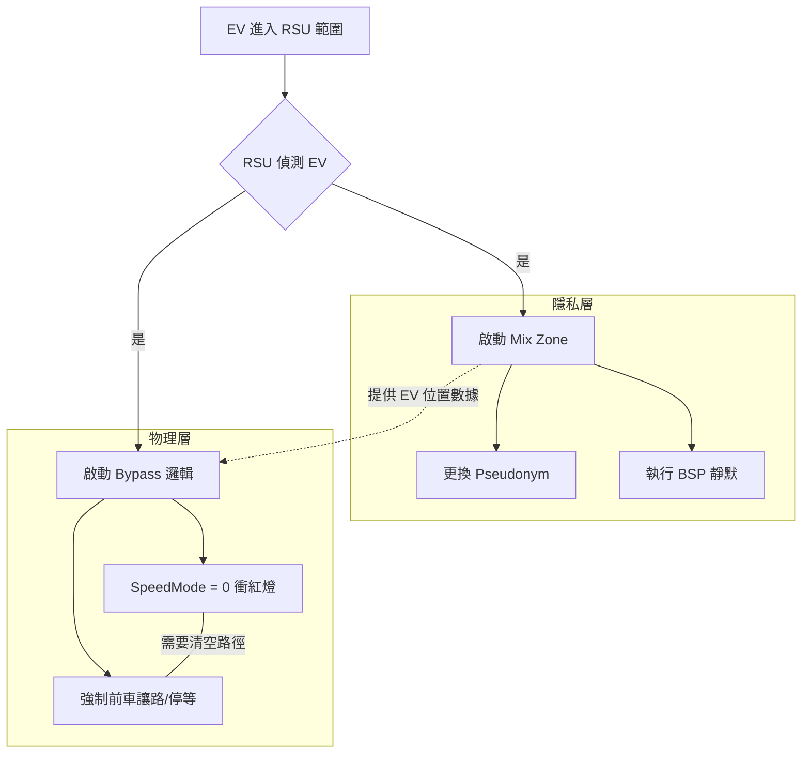

# BSP
車聯網繞路、mix zone存檔點

Viewed rsu.cc:1-800

這是一個非常核心且深入的問題。經過我們這幾次的調校與程式碼分析，我為您整理了這套系統的**核心邏輯全流程**，特別是「繞路（EV Bypass）」與「匿名區（Mix Zone）」之間的運作機制與關聯。

請參考這份完整的邏輯架構說明：

---

# V2X 救護車優先權與隱私管理系統：全流程邏輯報告

這份報告解析了系統如何在保障救護車（EV）快速通過的同時，啟動匿名區（Mix Zone）來保護周邊車輛隱私，並探討兩者間的耦合關係。

## 1. 救護車繞路（Bypass）邏輯流程

繞路邏輯的核心目標是：**「讓 EV 看到紅燈不停，且確保前方無礙。」**

### 執行階段：
1.  **感測與偵測**：RSU 透過 BSM 偵測到範圍內有 `EV` 標記的車輛。
2.  **紅燈預判 (`getEvSignalBypassSpeed`)**：
    *   檢查 EV 前方 45 公尺（`kEvSignalBypassLookaheadMeters`）是否有交通號誌（TLS）。
    *   若前方是**紅燈或黃燈**，計算旁路建議速度（預設為 13 m/s，約 46 km/h）。
    *   **修正後規則**：不論前方是否有前車，皆回傳建議速度（舊版會因為有前車而放棄繞行）。
3.  **模式強制轉換 (`applyEvAssist`)**：
    *   **SpeedMode = 0**：這是最關鍵的一步。將 EV 的速度模式設為 `0`，這會命令 SUMO 引擎**忽略紅燈、忽略安全跟車距離、忽略右方優先權**。
    *   **車道變換保護**：如果 EV 低速受阻，嘗試強制換道（Lane Escape）。
4.  **前方障礙物清除**：
    *   若 EV 正在執行繞行（紅燈前），RSU 會掃描 EV 正前方的前車（Leader）。
    *   **強制停等命令**：RSU 會對前車下達 `boundedSlowDown`，要求其在 1.5 秒內平順減速至完全停止，為 EV 清空路口內的物理空間。
5.  **物理平順化**：
    *   若 EV 目前車速遠高於繞行建議速度，會採用 1.2 秒的緩衝減速，避免產生 `-12 m/s²` 的非物理急煞。

---

## 2. 匿名區（Mix Zone）邏輯規則

匿名區的核心目標是：**「在 EV 出現的敏感時段，混合周邊車輛的身分（Pseudonym）。」**

### 啟動規則：
1.  **觸發條件 (`evaluateTrigger`)**：
    *   當 RSU 偵測到區域內有救護車（EV）時，立即將 `mzActive` 設為 `1`。
2.  **匿名組建段 (`onBSM`)**：
    *   進入範圍內的普通車輛會被分配到不同的 `anonSet`（匿名集合）。
    *   車輛在進入特定的 `mzRadius` 半徑後，RSU 會要求其更換虛擬 ID（Pseudonym）。
3.  **廣播與靜默週期（BSP）**：
    *   根據 EV 的距離，車輛可能會進入靜默期（不發送 BSM），直到 EV 通過後才恢復，以減少追蹤風險。

---

## 3. Mix Zone 與 繞路（Bypass）的關係

這兩個系統在程式碼中是**「併行且互補」**的關係。

### A. 觸發源的統一
兩者都依賴於 `rsu::extIdOf` 和 `CorridorEvState`。只要 EV 進入 RSU 的無線電覆蓋範圍，兩套邏輯會**同時啟動**。

### B. 職責的分工
*   **Mix Zone 是「環境清理」**：它是背景作業，負責改變周邊車輛的通訊行為（隱私層面）。
*   **Bypass 是「實體清道」**：它是指令作業，負責控制車輛的車速與車道（物理層面）。

### C. 控制邏輯的耦合點
在 `rsu.cc` 的 `onClock` 週期內：
1.  先計算 Mix Zone 的狀態。
2.  利用 Mix Zone 取得的 EV 最新狀態（位置、路段），傳遞給 `applyEvAssist` 進行繞路操作。

---

## 4. Mix Zone 啟動與否是否影響繞路？

這是最關鍵的設計問題，答案是：**程序上不直接連動，但實作上高度依賴。**

### 理論上：
*   **不影響**：`applyEvAssist`（繞路邏輯）的程式碼片段中，並沒有 `if(mzActive)` 這樣的判斷。也就是說，即便 Mix Zone 邏輯出錯沒啟動，繞路指令依然會發出。

### 實際上：
*   **高度影響**：
    *   **感測能力**：Mix Zone 啟動代表 RSU 進入了「高頻監控模式」。如果 Mix Zone 沒啟動，通常代表 RSU 根本沒偵測到 EV。
    *   **安全性**：如果只有繞路啟動（EV 衝紅燈），但匿名區的附帶功能（路廊清空 `CorridorClearing`）沒執行，EV 雖然會無視紅燈，但會撞上前方沒移動的普通車。
    *   **數據更新**：在我們的程式碼中，`evState` 的更新是與 RSU 週期同步的。匿名區的啟動通常伴隨著對 `evState` 的有效性驗證。

### 總結關係圖 (Mermaid)

**結論：** 雖然 Bypass 可以在沒有 Mix Zone 的情況下強行下達指令，但 **Mix Zone 的啟動是穩定獲取 EV 狀態的關鍵**。在您的模擬中，若 RSU[8] 的 Mix Zone 沒啟動（因為 EV 太快通過），就會導致繞路邏輯在該節點失效或反應不及。
