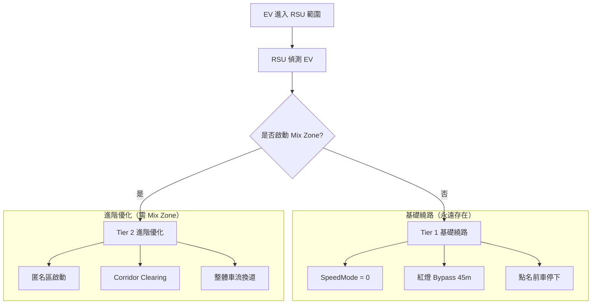
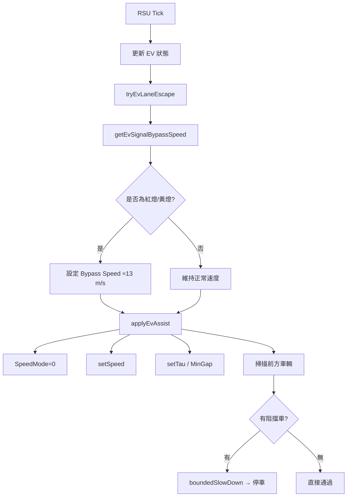
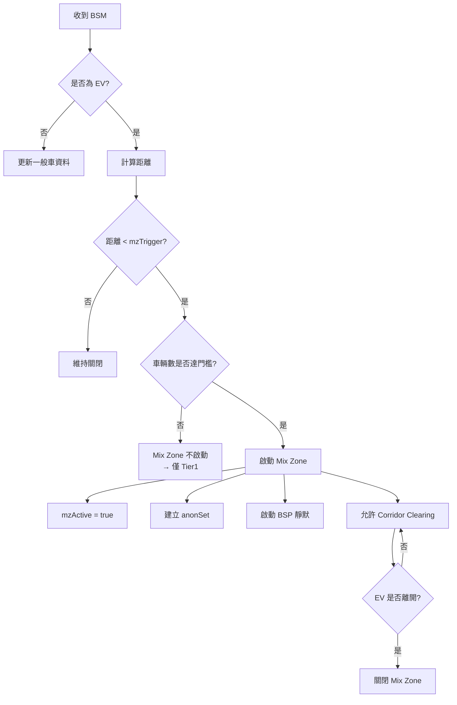
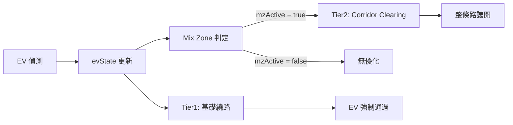
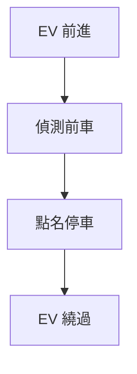
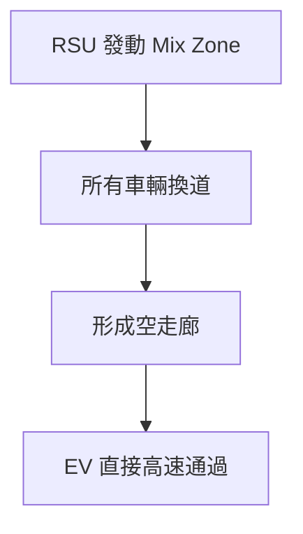
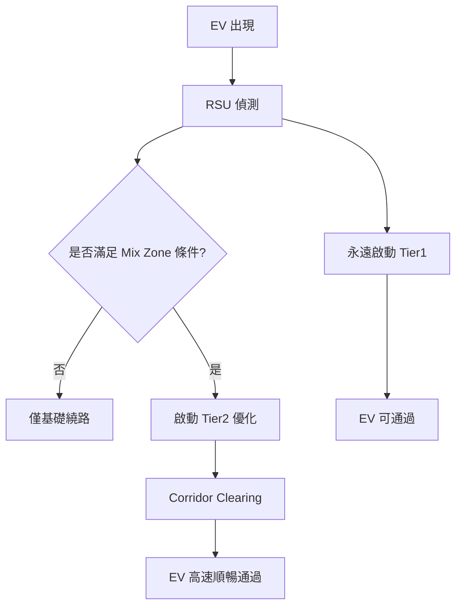

# V2X EV優先 + Mix Zone 系統（精煉版流程架構）

# 一、整體架構（兩層系統）

核心：
**Tier1 = 保證能過**
**Tier2 = 讓你順順過**

# 二、EV 繞路（Bypass）邏輯

總結：**讓 EV 不被號誌與前車阻擋**

## （1）輸入條件

當 RSU 偵測到：

* 車輛為 EV（emergency vehicle）
* 位於 RSU 覆蓋範圍內

才進入繞路流程

## （2）執行順序
### ① 車道逃逸（Lane Escape）

條件：
* EV 速度過低
* 或前方有阻擋

動作：
* 嘗試換道（避免卡死）
如果 EV 已經被卡住，後面所有「加速 / 無視紅燈」都沒用

### ② 紅燈預判（Signal Bypass）

條件：
* 前方 45m 內有號誌（TLS）
* 且為紅燈或黃燈

動作：
* 設定建議速度 ≈ 13 m/s（約 46 km/h）

**關鍵設計點：**

* 不管前方有沒有車 → 都回傳速度
因為要先決定「EV 應該怎麼過路口」

### ③ 開啟特權模式（SpeedMode = 0）

動作：
* 忽略：
  * 紅燈
  * 安全車距
  * 路權

1. 先算好「要怎麼走」
2. 再解除限制

### ④ 設定速度（setSpeed）

來源：
* bypass speed（紅燈情境）
* 或原本速度

### ⑤ 前車清除（Leader Clearing）

條件：
* EV 前方有車（leader）
動作：
* 對前車下達：
  * `boundedSlowDown`
  * 約 1.5 秒減速到 0

**設計理由：**
* 不直接瞬停 → 避免不合理物理行為
* 只處理「正前方」 → 最小干預

這一步是：
**保證 EV 一定有「物理空間」通過**

## （3）繞路邏輯總結

執行順序：
1. 避免卡死（換道）
2. 判斷紅燈並決定速度
3. 開啟特權模式（無視規則）
4. 設定行駛速度
5. 清除前方阻擋車

## （4）設計理念

### 原則 1：先解決「卡住問題」
→ Lane escape 最優先

### 原則 2：先決策，再解鎖限制
→ 先算速度，再 SpeedMode=0

### 原則 3：最小干預
→ 只停「必要的前車」，不動整個車流

## EV 繞路決策流程（RSU 每個 Tick）

# 三、Mix Zone（匿名區）邏輯

## （1）輸入條件

RSU 持續接收：
* 所有車輛 BSM
* EV 狀態

## （2）啟動條件（Trigger）

必須同時滿足：
1. EV 存在
2. EV 距離 < `mzTrigger`
3. 區域內車輛數 ≥ 匿名門檻（k-anonymity）

## （3）啟動流程（順序）

### ① 啟動 Mix Zone
動作：
* `mzActive = true`

**為什麼先設 flag？**
讓後續模組知道「現在是隱私模式」

### ② 建立匿名集合（anonSet）
動作：
* 將車輛分組
 **目的：**
讓個體無法被單獨識別（k-anonymity）

### ③ Pseudonym Change（換 ID）

動作：
* 車輛更換虛擬 ID

**設計理由：**
避免進出區域被連續追蹤

---

### ④ BSP 靜默機制

動作：

* 暫停或降低 BSM 發送

**設計理由：**
減少軌跡暴露

## （4）維持與結束

條件：
* EV 離開
  或
* 不再滿足門檻

動作：
* `mzActive = false`
* 清除匿名狀態

---

## （5）Mix Zone 邏輯總結

執行順序：
1. 偵測 EV
2. 判斷距離與車流量
3. 啟動 mzActive
4. 建立匿名集合
5. 更換 pseudonym
6. 啟動靜默

---

## （6）設計理念

### 原則 1：需要「人多才匿名」
→ k-anonymity

### 原則 2：動態啟動
→ 只在 EV 出現時啟動（敏感時刻）

### 原則 3：多層隱私保護
* ID 改變
* 通訊降低

## Mix Zone 啟動流程（隱私 + 優化開關）

---

# 四、關鍵「耦合點」簡化圖（最重要）

---

# 五、兩種情境對比

## 情境 A：沒有 Mix Zone（車少）

✔ 特點：
* 有點「強制」
* 局部處理
* 還是能過

---

## 情境 B：有 Mix Zone（車多）

✔ 特點：
* 全局控制
* 無需停車
* 最順最安全

# 六、最終系統邏輯總結

---

# 結論（最精準版本）

**Mix Zone = 不是讓 EV 能不能過，而是讓 EV「過得多順」**
**Tier1 決定「能不能過」；Tier2 決定「通過品質」**

