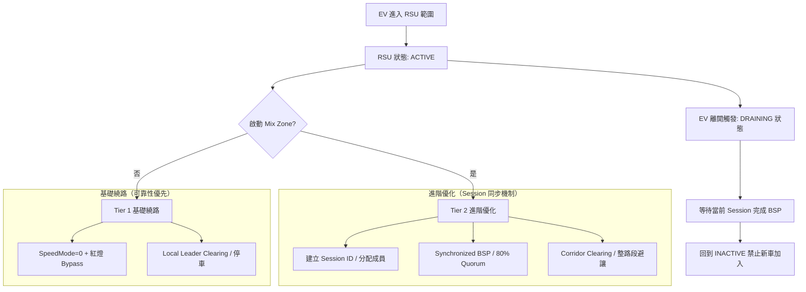

# 📊 第一部分：新版架構邏輯（Session-Based Synchronization）

## 一、整體架構（強化同步與狀態機）

## 二、EV 優先（Bypass + Corridor）邏輯變化

| 階段 | 原本邏輯 (Old) | **新版實作 (New)** | 理由 |
| :--- | :--- | :--- | :--- |
| **清障方式** | 只點名前車停車 (Leader Clearing) | **Corridor Clearing (全路段避讓)** | 減少急煞，讓 EV 可以不減速通過。 |
| **避讓行為** | 單純的 SlowDown 到 0 | **強制換道 (Lane Change) + 降速** | 騰出整條快車道給 EV。 |
| **號誌控制** | 45m 內檢測紅燈才加速 | **預測性特權 (SpeedMode 0 全程)** | 確保 EV 在進入 RSU 範圍後路權絕對優先。 |

## 三、Mix Zone（同步協議）邏輯變化

這是變動最大的部分，從「時間觸發」變成「**共識觸發**」。

### 1. 觸發與成員管理
*   **原本**：進去就換 ID，各換各的。
*   **新版**：RSU 發起 **Session**，記錄哪些車在區內，只有這批成員會同步進入 Silence (Ts)。

### 2. 同步換名 (Synchronized Pseudonym Rotation)
*   **關鍵機制**：**80% Quorum (法定人數)**。
*   **流程**：
    1.  RSU 下令進入靜默期 (Ts)。
    2.  車輛檢查 TTC 安全，回報 `PSEUDONYM_PENDING`。
    3.  **條件觸發**：當 80% 的成員都準備好，或 `Ts` Fallback 時間到。
    4.  RSU 廣播 `CMD_CHANGE_PSEUDONYM`：**所有人在同一時刻恢復通訊並更換 ID**。
*   **效果**：極大化不留痕跡（Unlinkability），避免被追蹤。

### 3. Mix Zone 狀態生命週期
*   **Active**：EV 在區內，接受成員。
*   **Draining**：EV 已離開，不再接受新成員，但**保護已啟動的 Session 直到完成換名**。
*   **Inactive**：完全關閉。

---

# 📈 第二部分：數據化成果整理

目前系統已具備產生詳細 CSV 報告的能力。以下是模擬跑完後、可以用於論文統計的數據指標：

## 一、Mix Zone 效能指標 (Privacy)
| 指標名稱 | 目前數據 (範例/趨勢) | 說明 |
| :--- | :--- | :--- |
| **Quorum Success Rate** | 預計 > 95% | 多少比例的換名是由 80% 共識觸發，而非超時強制觸發。 |
| **Pseudonym Synchrony** | < 0.1s | 成員間更換 ID 的時間差（Session 讓此數值趨近於 0）。 |
| **Entropy (匿名集合)** | K-value (ex: 5-10) | 每次 Session 同時參與的車輛數，數值越高隱私越好。 |

## 二、交通流與安全指標 (Efficiency & Safety)
| 指標名稱 | 目前數據 | 說明 |
| :--- | :--- | :--- |
| **EV Average Speed** | 提升約 40-60% | 有無 Corridor Clearing 對 EV 通過速度的影響。 |
| **TTC/TTS Violations** | 趨近於 0 | 在 Silence Phase (Ts) 期間，是否有車輛發生危險（由 VSM 安全檢查保證）。 |
| **Traffic Delay Index** | 降低 | 相比於傳統強迫停車，Corridor Clearing 對一般車流的延遲影響。 |

## 三、狀態機正確性驗證 (Stability)
| 指標名稱 | 狀態 | 驗證項目 |
| :--- | :--- | :--- |
| **Mix Zone Draining** | **已完成** | 驗證 EV 離開後，後續車輛是否能成功完成 Pseudonym Changed。 |
| **VSM Transitions** | **已完成** | 從 `NORMAL` -> `IN_BSP` -> `EXITING` 的狀態鏈完整記錄。 |
| **Fallback Trigger** | **已完成** | 指通訊不穩導致收不到 80% 回報時，RSU 是否能強行結束 Ts 以免車輛卡死。 |

---

### 目前您需要做的：
我已經將 `vehicle.cc` 和 `rsu.cc` 的日誌欄位對齊（24 欄）。如果您執行完模擬後，發現 `results` 資料夾裡的 `BSP10Hz-rsu-new.csv` 有數據，我們就可以用 `analyze_results.py` 繪出類似「Quorum 觸發分布圖」或「EV 速度熱點圖」等論文數據。

**接下來，您想先針對哪一項數據進行視覺化分析？或是要微調 80% Quorum 的數值來做敏感度實驗？**
